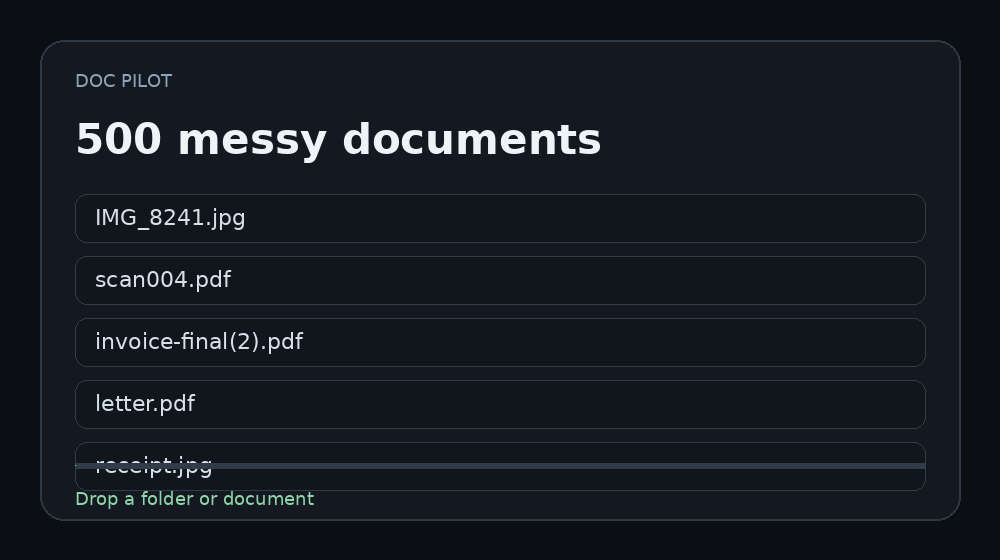

# DocPilot

[](https://github.com/lukaszst-cz/docpilot/actions/workflows/test.yml) [](https://github.com/lukaszst-cz/docpilot/actions/workflows/windows-release.yml)

DocPilot powstał z prostego problemu: po pewnym czasie folder z dokumentami przestaje być archiwum, a zaczyna być miejscem, w którym trzeba wszystkiego szukać ręcznie.

Program pomaga uporządkować skany, PDF-y, faktury, umowy i pisma. Odczytuje dokument, wyciąga z niego najważniejsze informacje, potrafi znaleźć termin, zaproponować nazwę i miejsce w archiwum, a później pozwala wrócić do dokumentu przez wyszukiwarkę.

Najważniejsza zasada jest prosta: **DocPilot najpierw pokazuje propozycję, a dopiero później wykonuje zmianę.**



## Pobierz dla Windows

**Stabilne wydanie: DocPilot v4.0.0**

- [Pobierz instalator Windows x64 (.exe)](https://github.com/lukaszst-cz/docpilot/releases/download/v4.0.0/DocPilot-Setup-Windows-x64.exe)
- [Pobierz wersję Portable Windows x64 (.zip)](https://github.com/lukaszst-cz/docpilot/releases/download/v4.0.0/DocPilot-Portable-Windows-x64.zip)
- [SHA256SUMS.txt](https://github.com/lukaszst-cz/docpilot/releases/download/v4.0.0/SHA256SUMS.txt)
- [Pełna strona wydania v4.0.0](https://github.com/lukaszst-cz/docpilot/releases/tag/v4.0.0)

Strona projektu:

https://lukaszst-cz.github.io/operations-office-portfolio/docpilot/

Do zwykłej instalacji wybierz **Setup EXE**. Wersja **Portable ZIP** działa bez instalowania programu.

Instalator nie jest jeszcze podpisany komercyjnym certyfikatem code-signing, dlatego Windows może wyświetlić ostrzeżenie SmartScreen.

### Dane po odinstalowaniu

Wersja Windows przechowuje dane użytkownika poza katalogiem programu, w lokalnym katalogu danych DocPilot. Standardowe odinstalowanie usuwa aplikację i wpis autostartu powiadomień, ale **nie usuwa archiwum, indeksu ani ustawień użytkownika**. Dzięki temu ponowna instalacja lub aktualizacja może korzystać z dotychczasowych danych.

### Recovery i baza dokumentów

W **Settings → Data & diagnostics** pole **Recovery readiness** odpowiada wprost na pytanie, czy lokalna baza ma zweryfikowany punkt odzyskiwania:

- **ready** — baza jest zdrowa i istnieje co najmniej jeden zweryfikowany punkt recovery;
- **checkpoint-recommended** — baza jest zdrowa, ale przed większą aktualizacją, masowymi zmianami lub konserwacją warto utworzyć checkpoint;
- **database-problem** — integralność bazy wymaga uwagi; nie wykonuj dużych zmian, dopóki nie sprawdzisz Recovery checkpoints.

Checkpoint dotyczy **lokalnego indeksu i ustawień SQLite**. Nie tworzy kopii wszystkich dokumentów źródłowych i nie cofa plików na dysku. Do pełnej kopii dokumentów służy **Full Archive Backup**.

Przywrócenie bazy wymaga ręcznego wpisania `RESTORE`. DocPilot przed podmianą aktywnej bazy zachowuje dodatkową kopię bezpieczeństwa, gdy jest to możliwe.

## Jak zacząć

Po uruchomieniu możesz od razu użyć **Try safe demo**. Program wczyta przykładową, sztuczną fakturę. Dzięki temu można zobaczyć sposób działania bez wskazywania własnych dokumentów.

Przy normalnej pracy wybierasz plik, DocPilot go analizuje i pokazuje m.in. rozpoznany typ dokumentu, datę, kwotę, termin, kategorię oraz proponowaną nazwę. Dopiero po sprawdzeniu tych informacji decydujesz, co zrobić dalej.

## Co potrafi

DocPilot czyta zwykłe PDF-y, obrazy i skany. Dla dokumentów obrazowych korzysta z OCR. W wydaniu Windows dołączony jest Tesseract z obsługą języka polskiego i angielskiego.

Potrafi wykrywać terminy płatności, odpowiedzi, gwarancji i ważności dokumentów. Dokument można oznaczyć np. jako wymagający zapłaty, odpowiedzi, podpisu albo ręcznego sprawdzenia.

Wyszukiwarka działa lokalnie. Można szukać nie tylko po nazwie pliku, ale także po treści i znaczeniu. Jest też proste Q&A, które odpowiada na podstawie lokalnie zindeksowanych dokumentów.

Program wykrywa duplikaty, porównuje dwie wersje dokumentu, grupuje dokumenty w sprawy i buduje ich chronologię.

Operacje na plikach są zapisywane w historii. Te, które da się odwrócić, można cofnąć.

## Prywatność

Podstawowe działanie programu jest lokalne: OCR, indeksowanie, wyszukiwanie, Q&A i praca na plikach odbywają się na komputerze użytkownika.

Połączenia z Notion, Google Calendar czy pocztą są opcjonalne i wymagają osobnej konfiguracji.

DocPilot nie powinien być traktowany jako źródło prawdy o ważnym terminie, kwocie albo danych z dokumentu. OCR i automatyczne rozpoznawanie mogą się pomylić, dlatego ważne informacje trzeba porównać z oryginałem.

## Funkcje, które nadal wymagają ostrożności

Redakcja danych w skanach i PDF-ach działa, ale przed wysłaniem takiego pliku trzeba go obejrzeć ręcznie.

Integracje z Gmail/Outlook, Notion i Google Calendar są opcjonalne. Przed synchronizacją można sprawdzić zakres danych, a wynik każdej operacji jest zapisywany w historii. Pierwszą synchronizację z usługą zewnętrzną najlepiej wykonać na małym zakresie i sprawdzić rezultat.

MCP jest przeznaczone dla osób, które wiedzą, po co chcą go użyć. Do zwykłego korzystania z DocPilot nie jest potrzebne.

## Dla bardziej technicznych

Szczegółowe granice modułów, formaty danych i zasady kompatybilności są opisane w [ARCHITECTURE.md](ARCHITECTURE.md).

DocPilot działa jako lokalna aplikacja z backendem FastAPI i bazą SQLite. Interfejs może działać jako aplikacja Windows lub PWA połączona z lokalnym serwisem.

Najważniejsze elementy:
- Python + FastAPI;
- SQLite;
- Tesseract OCR;
- OpenCV do poprawy skanów;
- lokalne wyszukiwanie TF-IDF + LSA;
- PyInstaller + Inno Setup dla wydania Windows;
- testy uruchamiane w GitHub Actions.

Wersję źródłową można uruchomić przez:

```powershell
python -m venv .venv
.venv\Scripts\activate
pip install -e ".[full]"
docpilot
```

Aplikacja działa lokalnie pod:

```text
http://127.0.0.1:8765
```

Testy:

```bash
pip install -e ".[full,dev]"
pytest -q
```

## Co zmienia 2.0

DocPilot 2.0 rozwija codzienny workflow bez zmiany podstawowej zasady bezpieczeństwa plików.

Najważniejsze zmiany:
- reguły seryjnych dokumentów można edytować, wstrzymywać, włączać i usuwać;
- analiza pokazuje, które reguły zadziałały, a nowsze reguły mają jawne pierwszeństwo;
- Documents obsługuje zaznaczanie i masową zmianę sprawy, profilu oraz wymaganej akcji;
- Cases & Timeline pokazuje liczbę dokumentów, otwarte działania, najbliższy przyszły termin i terminy przeterminowane;
- duże archiwa korzystają z lekkiej paginacji, filtrowania SQL i indeksu sortowania;
- profile inne niż Home mogą organizować pliki do osobnych przestrzeni w `archive/Profiles/<profile>`.

Zmiana samej wartości profilu w indeksie nie przenosi istniejącego pliku na dysku. Fizyczna przestrzeń profilu jest używana podczas operacji **organize**.

## Co zmienia 3.0

DocPilot 3.0 porządkuje integracje tak, żeby były przewidywalne i możliwe do kontrolowania przed wysłaniem danych poza komputer.

Najważniejsze zmiany:
- przed synchronizacją z Notion lub Google Calendar można ograniczyć zakres po profilu, sprawie, akcji i kategorii oraz podejrzeć przykładowe rekordy;
- każda synchronizacja i import poczty zapisują osobną historię z liczbą prób, sukcesów, pominięć, błędów i użytym zakresem;
- Notion i Google Calendar pamiętają powiązanie dokumentu z obiektem zewnętrznym, dzięki czemu niezmienione rekordy są pomijane, a zmienione aktualizowane zamiast tworzyć kolejne kopie;
- Portable Configuration przenosi reguły, własne typy dokumentów i bezpieczne ustawienia między instalacjami, bez haseł, tokenów OAuth i ścieżek charakterystycznych dla jednego komputera;
- integracje korzystają ze wspólnego registry adapterów, więc kolejny konektor może deklarować własny status, zakres i sposób synchronizacji bez dopisywania go na sztywno do głównego kodu aplikacji.

Podstawowy workflow nadal pozostaje lokalny. Dane trafiają do usługi zewnętrznej dopiero po wybraniu i uruchomieniu odpowiedniej integracji.

## Co zmienia 4.0

DocPilot 4.0 skupia się na dojrzałości i odporności zamiast dokładania kolejnych modułów.

Najważniejsze zmiany:
- jawnie opisane granice architektury i testy kompatybilności między modułami;
- kontrolowane migracje SQLite z backupem przed zmianą schematu i blokadą nieobsługiwanego downgrade;
- ręczne Recovery checkpoints, bezpieczne restore z kopią pre-restore oraz automatyczny checkpoint przy zmianie wersji;
- diagnostyka bazy, schematu, recovery i wolnego miejsca z prostymi zaleceniami dla użytkownika;
- lepsza praca na dużych archiwach: lekkie strony dokumentów, ograniczeni kandydaci dla Search/Q&A/Review i lżejszy Duplicate Finder;
- spójność Desktop/PWA i wykrywanie rozjazdu wersji cache względem lokalnego backendu;
- rozszerzone testy cyklu upgrade → recovery → ponowne uruchomienie;
- praktyczne README i Troubleshooting bez wymagania wiedzy o SQLite czy strukturze wewnętrznej programu.

Podstawowa zasada pozostaje bez zmian: najpierw analiza i podgląd, potem zatwierdzona operacja.

## Status wydania

Kod gałęzi `main` jest przygotowany jako **v4.0.0**. Publiczne pliki są publikowane z oznaczonego wydania, a linki w sekcji „Pobierz” zawsze prowadzą do najnowszego opublikowanego release.

Wydanie Windows przechodzi automatyczne testy, kontrolę składni frontendu, smoke testy typowych dokumentów i codziennego workflow, budowę aplikacji i modułu powiadomień, OCR obrazu i skanowanego PDF-u, self-test gotowego EXE, czystą instalację i uninstall z zachowaniem danych, upgrade z v0.5.1 na istniejącej bazie SQLite, budowę instalatora i Portable ZIP oraz wygenerowanie sum SHA-256.

Checklista stabilności 1.0 pozostaje w [`RELEASE-CHECKLIST.md`](RELEASE-CHECKLIST.md), a kierunek dalszego rozwoju jest prowadzony w roadmapie repozytorium.

## Zgłaszanie problemów

Najpierw sprawdź [TROUBLESHOOTING.md](TROUBLESHOOTING.md). W **Settings → Data & diagnostics** można też skopiować lub pobrać bezpieczny raport diagnostyczny bez treści dokumentów i lokalnych ścieżek.

Jeżeli coś nie działa, najlepiej otworzyć Issue i krótko opisać:
- co zostało zrobione;
- co miało się wydarzyć;
- co wydarzyło się faktycznie;
- jaka wersja Windows i DocPilot była używana.

Nie dodawaj do publicznego zgłoszenia prywatnych dokumentów, danych osobowych ani danych logowania.

## Licencja

MIT — szczegóły w pliku `LICENSE`.


## Zgłaszanie błędów i bezpieczeństwo

- [Zgłoś błąd](https://github.com/lukaszst-cz/docpilot/issues/new?template=bug_report.yml)
- [Zaproponuj funkcję](https://github.com/lukaszst-cz/docpilot/issues/new?template=feature_request.yml)
- [Zasady bezpieczeństwa](SECURITY.md)
- [Jak współtworzyć projekt](CONTRIBUTING.md)

---

## ☕ Wsparcie / Support

Jeśli ten projekt Ci się podoba lub jest dla Ciebie przydatny, możesz dobrowolnie wesprzeć jego dalszy rozwój.  
If you like this project or find it useful, you can support its further development.

**[☕ Postaw Naleśnikowi++ kawę / Buy Me a Coffee](https://buymeacoffee.com/nalesnik_plus_plus)**

